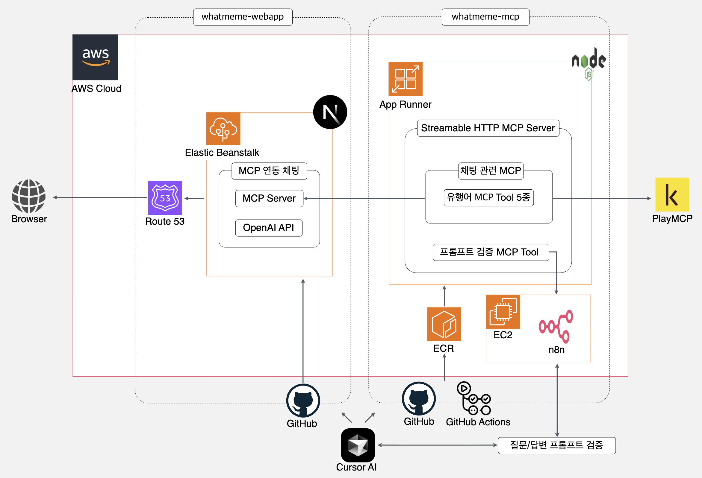

# whatmeme Web Chat Application

whatmeme MCP를 사용하는 웹 채팅 애플리케이션입니다. `gpt-4o-mini` 기반으로 동작합니다.

- Homepage: [https://whatmeme.site/](https://whatmeme.site/)
- PlayMCP: [https://playmcp.kakao.com/mcp/385/](https://playmcp.kakao.com/mcp/385/)

---

## Service Architecture

- Github(MCP Server): [https://github.com/whatmeme/whatmeme-mcp](https://github.com/whatmeme/whatmeme-mcp)
- Github(webapp Server): [https://github.com/whatmeme/whatmeme-webapp](https://github.com/whatmeme/whatmeme-webapp)
